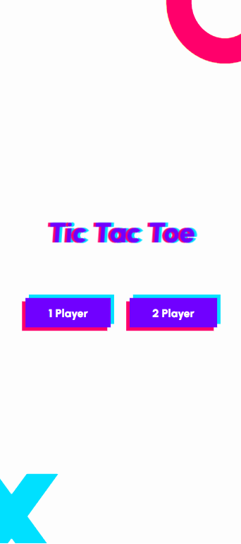
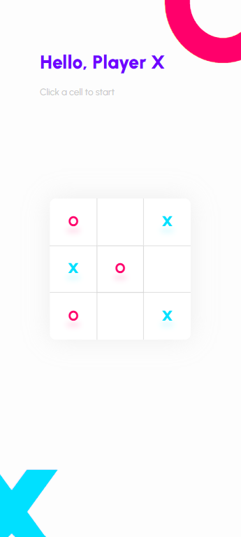

# 🎮 Tic Tac Toe

A simple, animated Tic Tac Toe game built with **HTML**, **SCSS**, and **JavaScript**. Play in single-player mode against a basic AI or challenge a friend in two-player mode.




---

## ✨ Features

-   ✅ Two game modes: One-player (vs computer) and Two-player
-   🎨 Clean, modern UI with SCSS styling
-   💡 Simple AI opponent for solo games
-   🧠 Win detection & draw logic
-   📱 Responsive design (works on mobile)

---

## 🕹️ How to Play

1. **Choose a mode**: One-player or Two-player.
2. **Take turns** clicking on the grid to place your mark (O or X).
3. The game automatically detects wins or draws.
4. Click **Restart** to play again.

---

## 🚀 Getting Started

### 1. Clone the repository

```bash
git clone https://github.com/your-username/tic-tac-toe.git
cd tic-tac-toe
```
